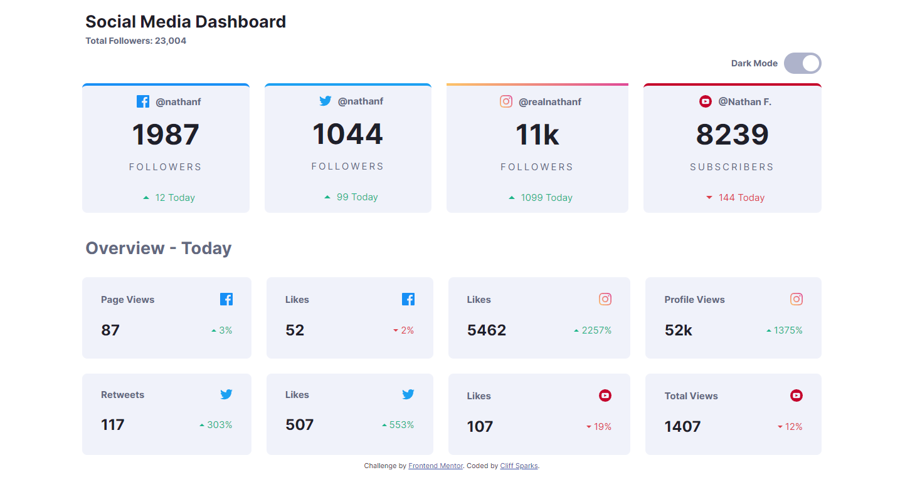

# Frontend Mentor - Social media dashboard with theme switcher solution

This is a solution to the [Social media dashboard with theme switcher challenge on Frontend Mentor](https://www.frontendmentor.io/challenges/social-media-dashboard-with-theme-switcher-6oY8ozp_H). Frontend Mentor challenges help you improve your coding skills by building realistic projects. 

## Table of contents

- [Overview](#overview)
  - [The challenge](#the-challenge)
  - [Screenshot](#screenshot)
  - [Links](#links)
  - [Built with](#built-with)
  - [What I learned](#what-i-learned)
  - [Continued development](#continued-development)
- [Author](#author)

## Overview

### The challenge

Users should be able to:

- View the optimal layout for the site depending on their device's screen size
- See hover states for all interactive elements on the page
- Toggle color theme to their preference

### Screenshot

### Links

- Solution URL: [Add solution URL here](https://github.com/csparks78/frontendDev/tree/main/social-media-dashboard-with-theme-switcher-master)
- Live Site URL: [Add live site URL here](https://csparks78.github.io/frontendDev/social-media-dashboard-with-theme-switcher-master/)

### Built with

- Semantic HTML5 markup
- CSS custom properties
- Flexbox
- CSS Grid
- Mobile-first workflow

### What I learned

One of the hardest things on this challenge was trying to figure out how to do gradient borders. 

### Continued development

I think I'm done with this one.

## Author

- Website - [Cliff Sparks](https://sparks3d.com/)
- Frontend Mentor - [@csparks78](https://www.frontendmentor.io/profile/csparks78)

